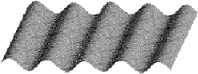

# 6-8 Shape Roof (50 分)

The kind of roof shown in Figure 1 is shaped from plain flat rectangular plastic board in Figure 2.

  
Figure 1
  
Figure 2

The transection of the roof is a sine curve which fits the function *y*(*x*)=*l*sin(*l**x*) in centimeters. Given the length of the roof, your task is to calculate the length of the flat board needed to shape the roof.

### Format of function:

```c
double Integral(double a, double b, double (*f)(double x, double y, double z), double eps, double l, double t);
```

where the function `Integral` returns the value of a definit integral of a given function pointed by `f` over a given interval from `double a` to `double b`. The integrant function `f` will be defined in the sample program of judge. Other parameters are: `double eps`, the accuracy of the resulting value of the integral; `double l` and `double t`, the altitude and the frequency of the sine curve, respectively.

**Note:** the length of the flat board which `Integral` returns must be in **meters**.

### Sample program of judge:

```c
#include <stdio.h>
#include <math.h>

double f0( double x, double l, double t )
{
    return sqrt(1.0+l*l*t*t*cos(t*x)*cos(t*x));
}

double Integral(double a, double b, double (*f)(double x, double y, double z), 
double eps, double l, double t);

int main()
{
    double a=0.0, b, eps=0.005, l, t;

    scanf("%lf %lf %lf", &l, &b, &t);
    printf("%.2f\n", Integral(a, b, f0, eps, l, t));

    return 0;
}

/* Your function will be put here */
```

### Sample Input:

```in
2 100 1
```

### Sample Output:

```out
1.68
```